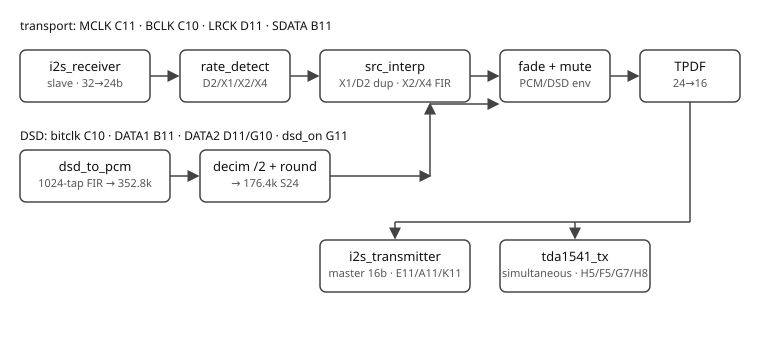

# FPGA SRC для Tang Primer 25K (GW5A-LV25MG121NC1/I0)

Передискретизация PCM и приём DSD для ЦАП без оверсемплинга (TDA1541).
Один образ на оба clock-домена (логика на отношениях к MCLK).

| Вход | MCLK | Выход (MCLK/256) |
|------|------|------------------|
| 44.1 / 88.2 / 176.4 / 352.8 кГц | 45.1584 МГц | 176.4 кГц |
| 48 / 96 / 192 / 384 кГц | 49.152 МГц | 192 кГц |

- 44.1/48 → x4, 88.2/96 → x2: minimum-phase полифазная FIR-интерполяция
  (плоская полоса 0–20 кГц, без предзвона).
- 176.4/192 → x1 побитово прозрачно; 352.8/384 → отброс каждой 2-й пары.
- DSD64…512 (Amanero-стиль, `dsd_on`=1) → PCM 176.4 кГц тем же трактом.
- Выход: I2S master 16 бит + TDA1541(A) simultaneous (offset binary).
- Перемычка A10–3.3V: NOS-режим (интерполятор выкл, чистой повтор).
  Переключать на стопе. DSD-децимация не отключается.

## Пины

| Сигнал | Пин | Примечание |
|--------|-----|------------|
| mclk_in | C11 | 45.1584 / 49.152 МГц от транспорта |
| i2s_bclk_in | C10 | входной битклок |
| i2s_lrck_in | D11 | входная сетка |
| i2s_sdata_in | B11 | входные данные (pull-down) |
| i2s_bclk_out | E11 | MCLK/8 |
| i2s_lrck_out | A11 | MCLK/256 |
| i2s_sdata_out | K11 | 16 бит, Philips |
| dsd_on | G11 | pull-down; 1 = native DSD (только при MCLK 45.1584) |
| dsd_data2_in | G10 | pull-down; DATA2 второго транспорта (автовыбор с LRCLK) |
| nos_bypass | A10 | pull-down; 1 = NOS |
| tda_bck_out | H5 | TDA1541 BCK |
| tda_le_out | F5 | TDA1541 LE |
| tda_dl_out | G7 | TDA1541 левый канал |
| tda_dr_out | H8 | TDA1541 правый канал |

В DSD-режиме транспорт отдаёт RIGHT по SDATA и LEFT по LRCLK —
top.v меняет их местами под PCM-раскладку.

## Сборка в Gowin IDE (Windows)

1. Устройство GW5A-LV25MG121NC1/I0, Verilog 2001.
2. Добавить: `top.v`, `i2s_receiver.v`, `rate_detect.v`, `src_interp.v`,
   `src_dupdrop.v`, `dither_24_16.v`, `i2s_transmitter.v`, `tda1541_tx.v`,
   `dsd_to_pcm.v`, `dsd_pcm_decim2.v`, `hb_sample_ram.v`,
   `dsd_round_s32_s24.v` + СВЕЖУЮ КОПИЮ `tools/interp_coefs.vh` рядом
   с RTL. `tools/gowin_sdpb_bb.v` и `gowin_bsram_sim.v` — только для
   локальной проверки, в Gowin не добавлять.
3. Констрейнты: `fir.cst`, `constraints.sdc` (MCLK tight-вариант 49.152).
4. Синтез → P&R (проверить положительный setup/hold slack) → прошить.

## Локальная проверка

`make verify` — 14 бенчей icarus + elaboration yosys. Нужны icarus-verilog,
yosys, python3+scipy. Должен быть зелёным до каждой прошивки.
